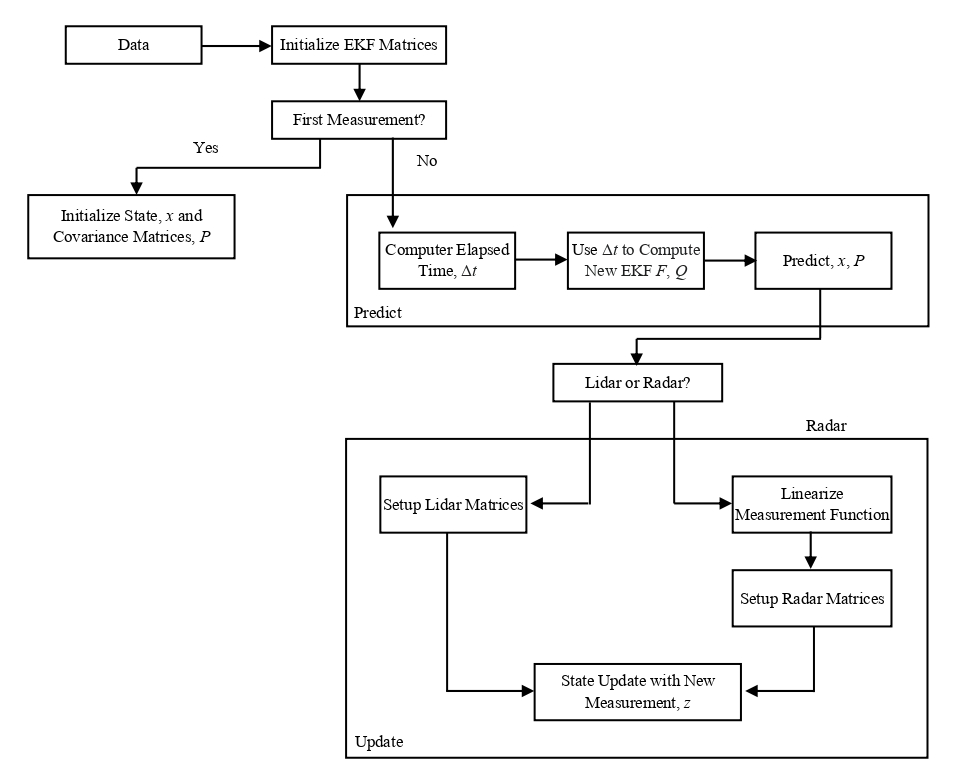

# Extended Kalman Filter Project

#### This project aims to develop a sensor fusion software pipeline for tracking the position and velocity of a moving object around an autonomous vehicle using [Extended Kalman Filter (EKF)](https://en.wikipedia.org/wiki/Extended_Kalman_filter) in C++. In particular, the EKF uses noisy lidar and radar measurements generated by [Udacity's Self-Driving Car Simulator](https://github.com/udacity/self-driving-car-sim/releases) to estimate the state of the object of interest. The pipeline is expected to determine the state of the object within a given tolerance of the root mean squared error (RMSE). 
<p> </p>

## Prerequisites
- To begin with, Udacity provides a [starter code](https://github.com/udacity/CarND-Extended-Kalman-Filter-Project/) for this project. This code uses WebSocket communication protocol to establish the communication between the sensor fusion software pipeline, i.e., the server-side, and the simulator, i.e., the client-side. 
- This project requires some tools to successfully compile and run the said software pipeline, and the readers can find their details [here](https://github.com/udacity/CarND-Extended-Kalman-Filter-Project/blob/master/README.md).
- The main program can be built and run by executing the following commands from the project top directory.
```
mkdir build
cd build
cmake ..
make
./ExtendedKF
```
## Sensor Fusion Software Pipeline
The below flowchart represents various steps of the sensor fusion software pipeline. 
<p> </p>
<td>  </td>
<p> </p>
The sensor fusion software pipeline involves three key steps: initialization, prediction, and update. Let us briefly understand each of them as follows. 
<p></p>

- Initialization: The first sensor measurement (irrespective of the type of sensor) is used to initialize the state vector (i.e., position and velocity in Cartesian space) of the moving object. 
- Prediciton: At first, this step calculates the time elapsed since the last iteration. Next, it updates the state transition matrix and the process noise or covariance matrix based on the elapsed time. Finally, it predicts the new state vector using the bicycle motion model, assuming a constant velocity. 
- Update: Here, the pipeline first maps the state vector into measurement space based on the type of sensor measurement using the state transition matrix. Then, it obtains the difference between the measurement and the predicted state, i.e., innovation provided by new sensor measurements in the estimation process. After that, it calculates the Kalman gain to combine the motion model's (or predicted state's) uncertainty and sensor measurements' uncertainty. The Kalman gain puts more weight on the motion model if the sensor measurements are very uncertain. Otherwise, it puts more weight on the sensor measurement. The predicted state is finally updated by adding the multiplication of the innovation with the Kalman gain.
<p></p>

In general, the prediction and update steps are performed alternatively, i.e., prediction followed by the update. However, if sensor observations are not available, more than one prediction step can be executed, while we may skip the update procedure and vice versa. 

## Implementation Details

The source code files associated with the pipeline are included in `src` folder of this repository and are listed below.
<p></p>

```
src
│───kalman_filter.h
│───kalman_filter.cpp
│───tools.h
│───tools.cpp
│───measurement_package.h
│───FusionEKF.h
│───FusionEKF.cpp
│───main.cpp
│───json.hpp
```

A brief overview of these files is provided as follows.
<p></p>

- `kalman_filter.h`: It contains the declaration of the `KalmanFilter` class. This class includes the state vector (i.e., the position and velocity in cartesian coordinate system) `x`, state transition matrix `F`, state covariance matrix `P`, process noise covariance matrix `Q`, measurement noise covariance matrix `R`, and measurement transition matrix `H`. Moreover, it also incorporates the member functions, namely `Predict()`, `Update()`,  and `UpdateEKF()`.  
- `kalman_filter.cpp`: It provides the definition of `Predict()`, `Update()`, and `UpdateEKF()` functions. These functions are utilized to predict the object's new state and update the state based on the lidar and radar measurements, respectively. The `Predict()` function uses the state vector `x`, state covariance matrix `P`, state transition matrix `F`, and process noise covariance matrix `Q` to predict the new state of the object of interest. The `Update()` function uses measurement transition matrix `H` defined for the linear model to update the predicted state based on the lidar data. This is because both the state vector and lidar measurements are in the cartesian coordinate system itself. However, the `UpdateEKF()` function employs Jacobian matrix as the measurement transition matrix `H` to perfrom the update process for radar data. The reason is that the state vector `x` is represented in a cartesian space, whereas the radar measurements are in the polar coordinate system, and the conversion from the cartesian coordinate system to the polar system involves nonlinear equations.
- `tools.h`: It comprises the declaration of `Tools` class. This class includes the member functions `CalculateRMSE()` and `CalculateJacobian()`.
- `tools.cpp`: It encompases the implementation of `CalculateRMSE()` and `CalculateJacobian()`. These functions are used to calcuate the RMSE between the estimated state and the ground truth (i.e., object's actual state) and the Jacobian matrix (i.e., measurement transition matrix) for the radar measurements, respectively.
- `measurement_package.h`: It includes the declaration of the `MeasurementPackage` class that temporarily stores the sensor measurement data with a timestamp. 
- `FusionEKF.h`: It comprises the declaration of `FusionEKF` class. This class creates the objects of `KalmanFilter` and `Tools` classes and includes a member function `ProcessMeasurement()`, which implemnets the whole flow of sensor fusion software pipeline.
- `FusionEKF.cpp`: It implements the definition of the `ProcessMeasurement()` function. This function uses the first sensor measurement to initialize the object's state and the subsequent measurements to predict and update the new state of the object. For prediction, it first updates the state transition matrix `F` and process noise covariance matrix `Q` based on the time elapsed between the previous and new measurements. Next, it predicts the object's new state by calling the `Predict()` function. After that, it updates the predicted state based on the type of measurement it has received from the simulator. When the new measurement is from the lidar sensor, it calls `Update()` function, whereas it first invokes the `CalculateJacobian()` function to calculate the Jacobian matrix and then executes the `UpdateEKF()` function for radar data.
- `main.cpp`: It establishes a TCP connection between the simulator and the software pipeline. The simulator then transmits the data measurements to the `main.cpp`, which is temporarily stored in an object of the `MeasurementPackage` class. Next, the `main.cpp` calls the `ProcessMeasurement()` function to update the state of the object being tracked. Besides, it also calls the `CalculateRMSE()` function to calculate the RMSE. Thereafter, it transmits the object's updated state and RMSE to the simulator.
- `json.hpp`: It is an open source single-header C++ library for handling JSON.

## Experimental Results
The implemented sensor fusion software pipeline was tested with two datasets provided the simulator. The RMSE for these datasets must be less than the following threshold values. 
<p></p>
<table>
  <tr>
    <td>Measurement</td>
    <td>RMSE Threshold</td>
  </tr>
  <tr>
    <td>Position in x dimension</td>
    <td>0.11</td>
  </tr>
   <tr>
    <td>Position in y dimension</td>
    <td>0.11</td>
  </tr>
  <tr>
    <td>Velocity in x dimension</td>
    <td>0.52</td>
  </tr>
   <tr>
    <td>Velocity in y dimension</td>
    <td>0.52</td>
  </tr>
 </table>
 <p></p>

The following table lists the results obtained by the implemented sensor fusion software pipeline for both the datasets. 
<p></p>
<table>
  <tr>
    <td>Measurement</td>
    <td>RMSE of Dataset 1</td>
    <td>RMSE of Dataset 2</td>
  </tr>
  <tr>
    <td>Position in x dimension</td>
    <td>0.0973</td>
    <td>0.0726</td>
  </tr>
   <tr>
    <td>Position in y dimension</td>
    <td>0.0855</td>
    <td>0.0965</td>
  </tr>
  <tr>
    <td>Velocity in x dimension</td>
    <td>0.4513</td>
    <td>0.4216</td>
  </tr>
   <tr>
    <td>Velocity in y dimension</td>
    <td>0.4399</td>
    <td>0.4932</td>
  </tr>
 </table>
 <p></p>

It can be observed that the RMSE for all the measurments is less than the given threshold values. The below videos present the output obtained by the sensor fusion software pipeline for both the dataset. 


https://user-images.githubusercontent.com/14021388/218286120-f409584d-1673-4136-b83b-4e560438fd1c.mp4


https://user-images.githubusercontent.com/14021388/218285621-cd67393d-b31a-4fc4-a2a5-c95d1c2613f3.mp4

In these videos, the car depicts the actual location and direction of the object being tracked, green triangles represent the estimated state of the object, red circles denote the lidar measurements, and blue circles depict the radar measurements with an arrow pointing in the direction of the observed angle. 

The readers are encouraged to read the following papers/books for a detailed discussions on Kalman Filter, Extended Kalman Filter, and filtering in general.

- [A new approach to linear filtering and prediction problems](https://asmedigitalcollection.asme.org/fluidsengineering/article-abstract/82/1/35/397706/A-New-Approach-to-Linear-Filtering-and-Prediction)
- [An Introduction to the Kalman Filter](https://perso.crans.org/club-krobot/doc/kalman.pdf)
- [Optimal filtering](https://books.google.co.in/books?hl=en&lr=&id=iYMqLQp49UMC&oi=fnd&pg=PP1&dq=+Optimal+Filtering.&ots=axXgmG5I9n&sig=plwDDCfod-KI6z5I0GySKgLY5hg&redir_esc=y#v=onepage&q=Optimal%20Filtering.&f=false)
- [Stochastic processes and filtering theory](https://books.google.co.in/books?hl=en&lr=&id=4AqL3vE2J-sC&oi=fnd&pg=PP1&dq=+Stochastic+Processes+and+Filtering+Theory&ots=428Tz42C1O&sig=a_2VV9h0wZxWNBy2ci1z3K3Caao&redir_esc=y#v=onepage&q=Stochastic%20Processes%20and%20Filtering%20Theory&f=false)
- [Kalman and Extended Kalman Filters: Concept, Derivation and Properties](https://d1wqtxts1xzle7.cloudfront.net/81315221/kalman-libre.pdf?1645663509=&response-content-disposition=inline%3B+filename%3DKalman_and_Extended_Kalman_Filters_Conce.pdf&Expires=1676161690&Signature=ULy5rMv7PawvcUIHo-ltHOM~ltGnPpaMqsB~jkTBO~5mS6JouCCSIwjYVZ-~pvBhBdHZXU0whhBfA8dQkM41IigD6afLv8YGqUxrZFFyJz5ZFTEqoudMX~-CrYH9Gayl96sQT~-0dy5wBhMVPQVFcMBFVoYcvnLdLaAM-8FvxvJuOg23KHiLlo1pKnbU-Tow99TrXcKoKrTJvJrXIf7e6hX5s5FU2XagyqbHAFBVLMmY5GWDbDsiyY82q8ZfnLhio-ayEmfE1PhEBR03qrYcMHgslyZ4QF7qf-4BtIYHIURzq~nXA6AgDLxgtNxxERMJi2I5Vpr1g818Ktcn00N5fw__&Key-Pair-Id=APKAJLOHF5GGSLRBV4ZA)
- [Kalman Filter for Robot Vision: A Survey](https://ieeexplore.ieee.org/abstract/document/5985520?casa_token=xCoPOq5__R4AAAAA:Zu7Z-ZTsGxmJUx43CkjMCvsoSDihcpOqxJa28PuR8-U7SSwDdfYvidUE6mTRCgmUuX4Db3UzHDA)

## Discussions

Although the implemented software pipeline has achieved the RMSE below the given thresholds, the RMSE can be further minimized using a more sophisticated process model.  It may be noted that the EKF can especially perform poorly when the predict and update functions are highly nonlinear as the covariance is propagated through the linearization of the underlying nonlinear model in EKF.

A better alternative could be to use an [Unscented Kalman Filter (UKF)](https://onlinelibrary.wiley.com/doi/abs/10.1002/0471221546.ch7) that approximates the probability distribution using sigma points. In particular, the UKF maps some points from the source Gaussian to the target Gaussian by transforming them using a nonlinear function. After that, it estimates the new mean and variance based on the transformed points. In many cases, the sigma points approximate the nonlinear model better than linearization does. In other words, the UKF can better estimate the turn rate of the object of interest. Besides, the UKF does not require to compute a Jacobian matrix. 
